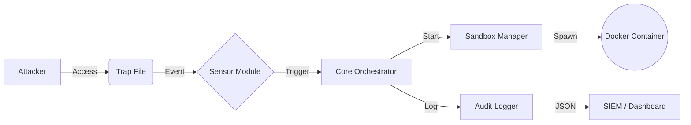

markdown
# Phantom Files Daemon


**Phantom Files** — это система активной защиты (Active Defense) класса **Deception**, реализованная в виде Linux-демона.
Система автоматически размещает полиморфные ловушки (Honeytokens) в инфраструктуре, мониторит несанкционированный доступ к ним и мгновенно изолирует угрозу, запуская Forensic-песочницу для сбора TTP (Tactics, Techniques, and Procedures) атакующего.

> **Ключевая особенность:** Проект реализует подход "Zero False Positives". Легитимные пользователи не взаимодействуют со скрытыми файлами-ловушками. Любое срабатывание — это подтвержденный инцидент.

---

## Функциональные возможности

*   **Полиморфные ловушки**: Модуль `Factory` генерирует уникальные файлы (изменяемые хеши, поддельные даты создания, динамический контент) используя `Faker` и `Jinja2`.
*   **Real-time Monitoring**: Сенсорная подсистема обнаруживает операции `OPEN`, `READ`, `COPY` за миллисекунды (используется абстракция над `inotify`).
*   **Автоматическая изоляция**: При сработывании триггера демон поднимает **Docker-контейнер**, имитирующий работу сервиса, и переключает внимание атакующего на него.
*   **Аудит безопасности**: Все события логируются в формате JSONL, готовом для интеграции с SIEM (ELK, Splunk, Graylog).
*   **Systemd Native**: Архитектура приложения соответствует стандартам Linux-сервисов (автозапуск, конфигурация через YAML, управление через systemctl).

---

## Архитектура

Проект построен по принципам **Hexagonal Architecture** (Ports and Adapters), что обеспечивает модульность и заменяемость компонентов (например, драйвер мониторинга или движок виртуализации).


---

## Установка и запуск

### Предварительные требования
*   Linux (Ubuntu/Debian/Arch)
*   Python 3.10+
*   Docker Engine

### 1. Клонирование и сборка
```bash
git clone https://github.com/your-username/phantom-daemon.git
cd phantom-daemon

# Установка пакета в систему
pip install -e .
```

### 2. Конфигурация
Отредактируйте файл `config/phantom.yaml`, указав директории для размещения ловушек и логов:
```yaml
paths:
  traps_dir: "/tmp/phantom_traps"
  logs_dir: "/var/log/phantom"
```

### 3. Запуск (Dev Mode)
Для отладки и просмотра логов в консоли:
```bash
# Через Makefile
make run

# Или напрямую
phantomd
```

### 4. Запуск (Production Mode)
Для запуска в фоне как системного сервиса:
```bash
# Копирование unit-файла
sudo cp deploy/phantom.service /etc/systemd/system/
sudo systemctl daemon-reload

# Запуск демона
sudo systemctl start phantom
sudo systemctl enable phantom

# Проверка статуса
systemctl status phantom
```

---

## Сценарий демонстрации

1.  **Deployment**: Демон запускается, считывает шаблоны из `resources/` и "минирует" папку `/tmp/phantom_traps`, создавая файлы `passwords.txt`, `salary_2024.docx` с фейковыми данными.
2.  **Reconnaissance**: "Злоумышленник" сканирует директорию и пытается прочитать `passwords.txt`.
3.  **Detection**: Сенсор перехватывает событие файловой системы.
4.  **Response**:
    *   В лог `/var/log/phantom/audit.json` записывается критический инцидент.
    *   Запускается контейнер `phantom_forensics_<id>`.
5.  **Analysis**: Система фиксирует время атаки, имя пользователя и затронутый файл.

---

## Технологический стек

*   **Core**: Python 3.10
*   **Monitoring**: `watchdog` (inotify wrapper)
*   **Isolation**: `Docker SDK for Python`
*   **Data Generation**: `Faker`, `Jinja2`
*   **Configuration**: `PyYAML`
*   **Build System**: `pyproject.toml` (PEP 518)

---

## Roadmap

*   [ ] Реализация драйвера сенсора на **eBPF (BCC)** для скрытого мониторинга системных вызовов (bypass-resistance).
*   [ ] Интеграция с **Firecracker microVM** для усиления изоляции песочницы.
*   [ ] Внедрение **Canary Tokens** в PDF и Word документы для отслеживания открытия файла вне периметра.
*   [ ] Интеграция уведомлений в Telegram/Slack.

---

## 📄 License

Distributed under the MIT License. See `LICENSE` for more information.
```
