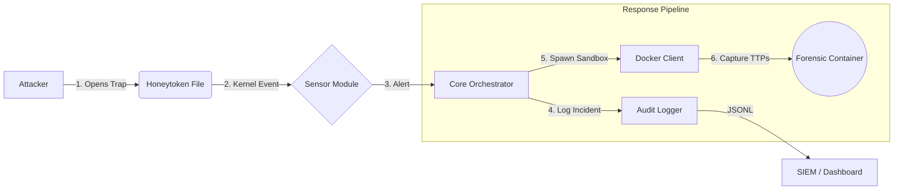

# 👻 Phantom Files Daemon

[](README.ru.md)


> **"The best defense is a trap."**

**Phantom Files** is an advanced **Active Defense / Deception** system designed for Linux environments.
It operates as a system daemon that automatically deploys high-fidelity **polymorphic honeytokens** (trap files), monitors unauthorized access in real-time, and instantly isolates the threat by spawning a **forensic sandbox** to capture attacker TTPs (Tactics, Techniques, and Procedures).

Unlike traditional honeypots that require dedicated servers, Phantom Files turns your existing infrastructure into a minefield without impacting legitimate users.

---

## ⚡ Key Features

### 🏭 1. Smart Polymorphic Factory
The system doesn't just copy files; it manufactures them.
*   **Template-Based Generation:** Uses **Jinja2** + **Faker** to generate valid configuration files (`.json`, `.yaml`, `.env`) with realistic but fake credentials.
*   **Shared Legend Context:** All generated traps share a consistent story (same fake admin name, same internal IP ranges, same passwords) across the system, making the deception indistinguishable from reality.
*   **Binary Polymorphism:** Implements **Steganographic Watermarking** for binary files (DOCX, XLSX, PDF). It injects a unique ID into the file structure (e.g., ZIP comments for Office files) without breaking validity. Every file has a unique hash sum.

### 🕵️ 2. Anti-Forensics & Time Stomping
*   **Time Stomping:** Automatically modifies `atime` and `mtime` metadata of generated traps. Files appear to be created months ago (randomized between 10-300 days), fooling attackers who look for "freshly created" baits.

### 👁️ 3. Kernel-Level Monitoring
*   **Zero-Latency Detection:** Uses `inotify` (via Watchdog) to detect file access events (`OPEN`, `ACCESS`) at the kernel level.
*   **Zero False Positives:** Traps are placed in non-business directories. Any interaction with them is, by definition, a security incident.

### 📦 4. Automated Forensic Response
*   **Instant Isolation:** Upon trigger, the daemon spawns an isolated **Docker container** (`phantom-forensics`) pre-loaded with analysis tools (`tcpdump`, `strace`).
*   **Evidence Collection:** Captures network traffic (PCAP) and system behavior from the exact moment of the breach.

---

## 🏗 Architecture

The project follows **Hexagonal Architecture**, ensuring that the detection logic, trap generation, and response mechanisms are decoupled and easily extensible.



---

## 🚀 Installation

### Prerequisites
*   Linux (Ubuntu/Debian/Arch)
*   Python 3.10+
*   Docker Engine installed and running

### Quick Start

1.  **Clone the repository:**
    ```bash
    git clone https://github.com/your-username/phantom-daemon.git
    cd phantom-daemon
    ```

2.  **Install the package:**
    ```bash
    make install
    ```
    *This command installs Python dependencies and builds the `phantom-forensics` Docker image.*

3.  **Run in Dev Mode:**
    ```bash
    make run
    ```

4.  **Verify Trap Generation:**
    ```bash
    make check
    ```
    *Runs a manual verification script to check file creation, time stomping, and binary integrity.*

---

## ⚙️ Configuration

The system is fully data-driven. You don't need to touch the code to add new traps.

### 1. Main Config (`config/phantom.yaml`)
Define system paths and sandbox behavior.
```yaml
paths:
  traps_dir: "/tmp/phantom_traps"
  logs_dir: "/var/log/phantom"

sandbox:
  image: "phantom-forensics:v1"
  command: "tcpdump -i eth0 -w /evidence/capture.pcap"
```

### 2. Trap Manifest (`config/traps_manifest.yaml`)
Define your minefield.
```yaml
traps:
  - id: trap-aws-root
    template: aws_credentials.txt.j2
    output: .aws/credentials
    category: credential
    priority: critical

  - id: trap-salary-doc
    template: binary/payroll_template.docx
    output: Executive_Salaries_2024.docx
    category: document
    format: binary
```

---

## 🛡️ Demo Scenario

1.  **Deployment:** The daemon starts. It reads the manifest and deploys 5 unique traps into `/tmp/phantom_traps`.
2.  **Reconnaissance:** An "attacker" (you) lists the directory. You see `Executive_Salaries.docx` created "6 months ago".
3.  **Trigger:** You try to read `passwords.txt`.
4.  **Reaction:**
    *   **Console:** `🚨 TRAP TRIGGERED: passwords.txt`
    *   **Logs:** A structured JSONL event is written to `audit.json`.
    *   **Docker:** A hidden container starts recording network traffic in the background.

---

## 🔮 Roadmap

*   [ ] **eBPF Sensor:** Implement a kernel-space sensor using BCC for stealthier monitoring (bypassing user-space hooks).
*   [ ] **LLM Integration:** Use local LLMs (Llama 2) to generate semantic content for email archives and chat logs.
*   [ ] **Firecracker MicroVMs:** Replace Docker with microVMs for hardware-level isolation.
*   [ ] **Active Blocking:** Integrate with `iptables` to automatically ban the attacker's IP.

---

## 📄 License

Distributed under the MIT License. See `LICENSE` for more information.
```