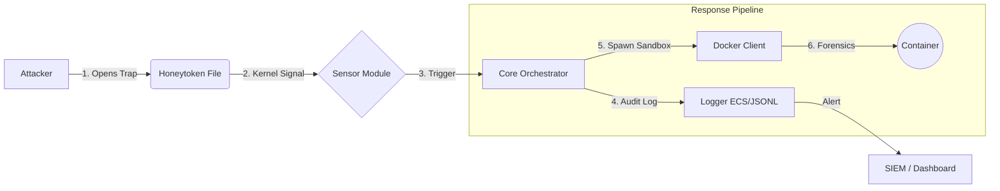

<div align="center">

# 👻 Phantom Files Daemon

**Advanced Active Defense & Deception System for Linux**

[](https://python.org)
[](https://docker.com)
[](LICENSE)
[]()
[](README.ru.md)

<p align="center">
  <a href="#-key-features">Key Features</a> •
  <a href="#-architecture">Architecture</a> •
  <a href="#-quick-start">Quick Start</a> •
  <a href="#-configuration">Configuration</a> •
  <a href="#-roadmap">Roadmap</a>
</p>

</div>

---

## 🛡️ Overview

**Phantom Files** is a lightweight, system-level daemon that turns your infrastructure into a minefield for attackers. It implements **Deception** tactics by automatically deploying high-fidelity **polymorphic honeytokens** (fake files) and monitoring them in real-time.

Unlike passive honeypots, Phantom Files acts as an **Active Defense** system. Upon detecting access to a trap file, it instantly spawns an isolated **Forensic Sandbox** (Docker container) to capture the attacker's TTPs (Tactics, Techniques, and Procedures) and network traffic without risking the host system.

> **Philosophy:** "Zero False Positives." Legitimate users have no business touching these files. Any interaction is a confirmed high-fidelity security incident.

---

## ⚡ Key Features

### 🏭 1. Polymorphic Trap Factory
The system synthesizes files rather than just copying them. Every deployment is unique.
*   **Template-Based Generation:** Uses **Jinja2** + **Faker** to generate syntactically valid configuration files (`.json`, `.yaml`, `.env`) filled with realistic fake credentials.
*   **Shared Legend Context:** All traps share a consistent narrative (same fake admin identity, internal IP ranges, and passwords) across the system.
*   **Binary Polymorphism:** Implements **Steganographic Watermarking** for binary files (`.docx`, `.xlsx`, `.pdf`). It injects unique IDs into ZIP comments or file tails, ensuring every file has a unique hash sum.

### 🕵️ 2. Anti-Forensics & Time Stomping
*   **Time Stomping:** Automatically manipulates `atime` and `mtime` of generated traps. Files appear to be created months ago (randomized 10-300 days), bypassing heuristic analysis that looks for "freshly created" baits.

### 👁️ 3. Kernel-Level Monitoring
*   **Real-time Detection:** Uses `inotify` (via Watchdog) to intercept file system events (`OPEN`, `ACCESS`) with millisecond latency.
*   **Low Overhead:** The daemon sits idly until a trap is touched, consuming negligible CPU resources.

### 📦 4. Automated Forensic Response
*   **Ephemeral Sandbox:** Instantly spawns a hidden **Docker container** (`phantom-forensics`) equipped with `tcpdump` and analysis tools.
*   **Evidence Collection:** Captures a full PCAP (Packet Capture) of the incident, logging the attacker's attempts to use the stolen credentials or connect to C2 servers.

---

## 🏗 Architecture

The project follows **Hexagonal Architecture**, decoupling the core logic from external systems (FS, Docker).



---

## 🚀 Quick Start

### Prerequisites
*   Linux (Ubuntu/Debian/Arch)
*   Python 3.10+
*   Docker Engine

### Installation

1.  **Clone the repository:**
    ```bash
    git clone https://github.com/your-username/phantom-daemon.git
    cd phantom-daemon
    ```

2.  **Install dependencies & Build Image:**
    ```bash
    make install
    ```
    *This command installs the package in editable mode and builds the `phantom-forensics` Docker image.*

3.  **Verify Trap Generation (Dry Run):**
    ```bash
    make check
    ```
    *Runs a manual verification script to ensure traps are generated correctly with time-stomping.*

4.  **Run the Daemon:**
    ```bash
    sudo make run
    ```

---

## ⚙️ Configuration

Phantom Files is **Data-Driven**. You define traps in `config/traps_manifest.yaml`.

```yaml
traps:
  - id: trap-aws-root
    template: aws_credentials.txt.j2
    output: .aws/credentials
    category: credential
    priority: critical

  - id: trap-salary-doc
    template: binary/payroll_template.docx
    output: Executive_Salaries_2024.docx
    category: document
    format: binary
```

---

## 📄 License

Distributed under the MIT License. See `LICENSE` for more information.

---
