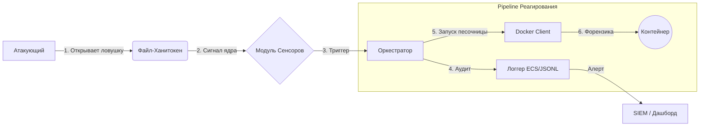

<div align="center">

# 👻 Phantom Files Daemon

**Продвинутая система активной защиты и Deception для Linux**

[](https://python.org)
[](https://docker.com)
[](LICENSE)
[]()
[](README.md)

<p align="center">
  <a href="#-ключевые-возможности">Возможности</a> •
  <a href="#-архитектура">Архитектура</a> •
  <a href="#-быстрый-старт">Запуск</a> •
  <a href="#-конфигурация">Настройка</a> •
  <a href="#-roadmap">Планы</a>
</p>

</div>

---

## 🛡️ О проекте

**Phantom Files** — это легковесный системный демон, который превращает вашу инфраструктуру в минное поле для злоумышленников. Он реализует тактику **Deception** (Обман), автоматически размещая высокоточные **полиморфные ханитокены** (файлы-ловушки) и отслеживая доступ к ним в реальном времени.

В отличие от пассивных ханипотов, Phantom Files действует как система **Активной Защиты**. При обнаружении доступа к файлу-ловушке демон мгновенно запускает изолированную **Forensic-песочницу** (Docker-контейнер) для сбора TTP (Тактик, Техник и Процедур) атакующего и перехвата сетевого трафика, не подвергая риску основной хост.

> **Философия:** "Ноль ложных срабатываний". Легитимные пользователи не взаимодействуют с этими файлами. Любое касание ловушки — это подтвержденный инцидент безопасности с высокой точностью.

---

## ⚡ Ключевые возможности

### 🏭 1. Полиморфная фабрика ловушек
Система синтезирует файлы, а не просто копирует их. Каждое развертывание уникально.
*   **Генерация по шаблонам:** Использует связку **Jinja2** + **Faker** для создания синтаксически верных конфигурационных файлов (`.json`, `.yaml`, `.env`), наполненных реалистичными фейковыми данными.
*   **Связанная легенда (Shared Context):** Все ловушки объединены общим контекстом (одно имя фейкового админа, одни внутренние IP-диапазоны и пароли), что делает обман неотличимым от реальности.
*   **Бинарный полиморфизм:** Использует **стеганографические водяные знаки** для бинарных файлов (`.docx`, `.xlsx`, `.pdf`). Уникальные ID внедряются в комментарии ZIP-архивов или хвосты файлов, обеспечивая уникальную хеш-сумму для каждого файла.

### 🕵️ 2. Анти-форензика и Time Stomping
*   **Подделка времени (Time Stomping):** Демон автоматически манипулирует метаданными `atime` и `mtime` созданных ловушек. Файлы выглядят созданными месяцы назад (рандомизация 10-300 дней), обходя эвристический анализ атакующих, ищущих "свежие" файлы.

### 👁️ 3. Мониторинг на уровне ядра
*   **Детекция в реальном времени:** Использует `inotify` (через Watchdog) для перехвата событий файловой системы (`OPEN`, `ACCESS`) с миллисекундной задержкой.
*   **Низкая нагрузка:** Демон находится в режиме ожидания, пока ловушка не будет затронута, потребляя минимум ресурсов CPU.

### 📦 4. Автоматическое реагирование и форензика
*   **Эфемерная песочница:** Мгновенный запуск скрытого **Docker-контейнера** (`phantom-forensics`), оснащенного `tcpdump` и инструментами анализа.
*   **Сбор улик:** Захват полного дампа сетевого трафика (PCAP) инцидента, логирование попыток атакующего использовать украденные данные или подключиться к C2-серверам.

---

## 🏗 Архитектура

Проект построен по принципам **Гексагональной архитектуры**, что обеспечивает независимость бизнес-логики от внешних систем (ФС, Docker) и легкость расширения.



---

## 🚀 Быстрый старт

### Требования
*   Linux (Ubuntu/Debian/Arch)
*   Python 3.10+
*   Docker Engine

### Установка

1.  **Клонирование репозитория:**
    ```bash
    git clone https://github.com/your-username/phantom-daemon.git
    cd phantom-daemon
    ```

2.  **Установка зависимостей и сборка образа:**
    ```bash
    make install
    ```
    *Эта команда устанавливает пакет в режиме редактирования и собирает Docker-образ `phantom-forensics`.*

3.  **Проверка генерации ловушек (Тест):**
    ```bash
    make check
    ```
    *Запускает скрипт ручной верификации для проверки создания файлов, корректности Time Stomping и целостности.*

4.  **Запуск демона:**
    ```bash
    sudo make run
    ```

---

## ⚙️ Конфигурация

Phantom Files управляется данными (**Data-Driven**). Вы определяете ловушки в файле `config/traps_manifest.yaml`.

```yaml
traps:
  - id: trap-aws-root
    template: aws_credentials.txt.j2
    output: .aws/credentials
    category: credential
    priority: critical

  - id: trap-salary-doc
    template: binary/payroll_template.docx
    output: Executive_Salaries_2024.docx
    category: document
    format: binary
```

---

## 🔮 Roadmap (Планы)

*   [ ] **Сенсор eBPF:** Реализация сенсора пространства ядра с использованием BCC/libbpf для скрытого мониторинга системных вызовов (обход хуков в user-space).
*   [ ] **Интеграция LLM:** Использование локальных LLM (Llama 2) для генерации семантического контента для архивов электронной почты и логов чатов.
*   [ ] **Микро-VM Firecracker:** Замена Docker на микро-виртуальные машины для изоляции на аппаратном уровне.
*   [ ] **Активная блокировка:** Интеграция с `iptables` / `nftables` для автоматического бана IP-адреса атакующего.

---

## 📄 Лицензия

Распространяется под лицензией MIT. Подробнее см. в файле `LICENSE`.